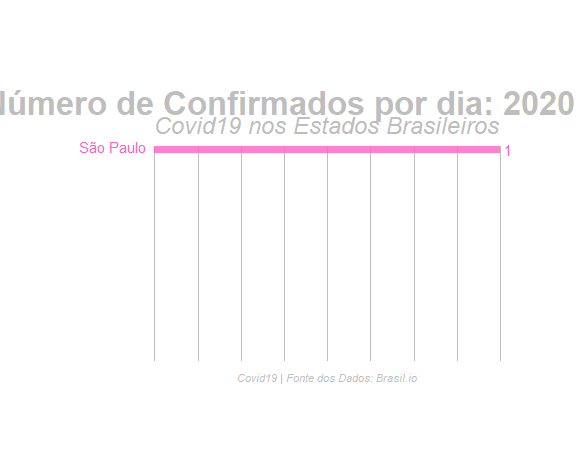

```{r setup, include=FALSE}
Sys.time()
library(flexdashboard)
library(tidyverse)
library(ggrepel)
library("hrbrthemes")
library("treemap")
library(lubridate)
#install.packages("remotes")
#remotes::install_github("d3treeR/d3treeR")
library(d3treeR)
library(data.table)
# Apenas a primeira vez
# count_acessos <- 0
# saveRDS(count_acessos, file = "./count_acessos.rds")

# Definindo tempo zero com 18h/horário de São Paulo:
#t0 <- as_datetime(as.Date("2020-03-31") + dhours(21), tz = "America/Sao_Paulo")
#saveRDS(t0, file = "./time0.rds")
t0 <- readRDS(file = "./time0.rds")

# Pegando hora atual de acordo com horário de São Paulo:
t1 <- as_datetime(Sys.time(), tz = "America/Sao_Paulo")

if (duration(int_length(interval(t0, t1))) >= duration(43200)) {
 # Baixando os dados de 12 em 12 horas de acordo com acessos a aplicação:
  download.file(url = "https://brasil.io/dataset/covid19/caso?format=csv", destfile = "./covid19.csv")
  t0 <- t1
  saveRDS(t1, file = "./time0.rds")
}

#download.file(url = "https://brasil.io/dataset/covid19/caso?format=csv", destfile = "./covid19.csv")

# json_file <- "https://brasil.io/api/dataset/covid19/caso/data?format=json"
# #json_data <- jsonlite::fromJSON(file = json_file)
# 
# json_data <- fromJSON(paste(readLines(json_file, n = -2L, encoding = "UTF-8"), collapse=""))
# str(json_data)
# data <- data.frame(json_data$results)

data <- fread("covid19.csv", encoding = "UTF-8")
data$deaths[is.na(data$deaths)] <- 0
data$date <- as.Date(data$date)
data <- data[order(data$date) , ]
data$deaths_100k_inhabitants <- ((data$deaths)/(data$estimated_population_2019))*100000

data <- data %>%
  dplyr::filter(place_type == "state") %>%
  dplyr::group_by(state,date, confirmed,deaths) %>% 
  select(date, state, confirmed, deaths, estimated_population_2019,confirmed_per_100k_inhabitants)
names(data) <- c("date", "state", "confirmed", "deaths", "Pop", "quant_confirmed_100k_hab")

aggSetor <-data%>%filter(date==(last(data$date)-1))%>%group_by(state) %>% 
  summarise(quantidade = sum(deaths), confirmedM = mean(confirmed))
aggSetor$escala <- scale(aggSetor$confirmedM)

```


Visualização por Estado
===

Comandos2 {.sidebar}
---
<p style="text-align: justify;">
Este Fleshdashboard foi criado para facilitar a visualização de dados sobre o Covid19 nos Estados do Brasil.
</p>


**Autor:** Prof. Fernando de Souza Bastos

Universidade Federal de Viçosa

**Last update:** Atualização automática de 12h em 12h. (Obrigado Rumenick Pereira!)

```{r}
inputPanel(selectInput("codeInput2",label ="Escolha um Estado",
                      choices = sort(unique(data$state), decreasing = FALSE), selectize = F),
	renderText({paste0("Você Escolheu: ",input$codeInput2)}),
	renderText({paste0("População: ", unique(df()$Pop), " Habitantes")}))

HTML('<div align="center">
			<a href="https://fsbmat-ufv.github.io/" target="_blank"></a>
			</div>')

```

Box {data-width=400 data-heigth=300 .tabset}
-------------------------

### Casos Acumulados
```{r}
df<-reactive({data %>% filter(state==input$codeInput2)})
#df <- filter(dataset(), deaths>0)
#teste1 <- as.Date(min(df$date))

# teste1 <- reactive({
#   df <- filter(dataset(), deaths>0)
#   return(min(as.character(df$date)))
# })

#renderText({teste1()})


confirmed_color <- rgb(20, 120, 190, maxColorValue = 255)
death_color <- rgb(220, 40, 40, maxColorValue = 255, alpha = 230)
plotly::renderPlotly({
plotly::plot_ly(df(), type = "scatter", mode = 'lines') %>%
  plotly::add_trace(x = ~date,
                    y = ~deaths,
                    type = "scatter",
                    mode = "lines+markers",
                    name = "Óbitos",
                    line = list(color = death_color),
                    marker = list(color = death_color)) %>%
  plotly::add_trace(x = ~date,
                    y = ~confirmed,
                    type = "scatter",
                    mode = "lines+markers",
                    name = "Confirmados",
                    opacity = 1,
                    line = list(color = confirmed_color),
                    marker = list(color = confirmed_color)) %>%
  plotly::layout(title = "",
                 yaxis = list(title = "Frequência acumulada de casos"),
                 xaxis = list(title = ""),
                 legend = list(x = 0.1, y = 0.9),
                 hovermode = "compare")
})
```


### Óbitos por Estado
```{r}

    xlab <- "Data"
    legenda <- "fonte: https://brasil.io/dataset/covid19/caso"
    
plotly::renderPlotly({
plotly::ggplotly(ggplot2::ggplot(df(), aes(x = date, y = deaths)) +
      geom_bar(stat = "identity", alpha = .7, color = "red", fill = "orangered") +
      scale_x_date(date_breaks = "1 day",
                   date_labels = "%d/%m") +
      scale_y_continuous(limits = c(0, max(df()$deaths+20, na.rm = TRUE) + 3),
                         expand = c(0, 0)) +
      geom_text(aes(label=deaths), position=position_dodge(width=1.5), vjust=0, size=4) +
      labs(x = xlab,
           y = "Número de Óbitos",
           title = paste("Número de mortes por COVID-19 no Estado", input$codeInput2),
           caption = legenda) +
      theme_minimal() +
      theme(axis.text.x =  element_text(angle = 90), plot.title = element_text(color = "black", size = 16, face = "bold")))
    
  })
```

### Número de Confirmados

```{r}

    xlab <- "Data"
    legenda <- "fonte: https://brasil.io/dataset/covid19/caso"
    
plotly::renderPlotly({
plotly::ggplotly(ggplot2::ggplot(df(), aes(x = date, y = confirmed)) +
      geom_bar(stat = "identity", alpha = .7, colour="yellow", fill = "lightgoldenrodyellow") +
      scale_x_date(date_breaks = "1 day",
                   date_labels = "%d/%m") +
      scale_y_continuous(limits = c(0, max(df()$confirmed+100, na.rm = TRUE) + 3),
                         expand = c(0, 0)) +
      geom_text(aes(label=confirmed), position=position_dodge(width=0.9), size=4) +
      labs(x = xlab,
           y = "Número de Confirmados",
           title = paste("Número de Casos Confirmados com Covid19 no Estado", input$codeInput2),
           caption = legenda) +
      theme_minimal() +
      theme(axis.text.x =  element_text(angle = 90), plot.title = element_text(color = "black", size = 12, face = "bold")))
    
  })
```


### Número de Casos Diários por Estado

```{r}

dataset<-reactive({data %>% filter(state==input$codeInput2)})

  
dataset3 <- reactive({ndeaths <- data %>% group_by(date) %>% summarise(deaths = sum(deaths))  
return(ndeaths)
  })
  
dataset4 <- reactive({nconfirmed <- data %>% group_by(date) %>% summarise(confirmed = sum(confirmed))
    return(nconfirmed)
  })


dataset2<-reactive({
    df <- df()
    teste1 <- dplyr::lag(df$deaths)
    teste1[is.na(teste1)] <- 0
    teste2 <- dplyr::lag(df$confirmed)
    teste2[is.na(teste2)] <- 0
    df$teste1 <- teste1
    df$teste2 <- teste2
    df$deaths_day <- df$deaths-df$teste1
    df$confirmed_day <- df$confirmed-df$teste2
    df <- df %>% select(date,state,confirmed,deaths,Pop,quant_confirmed_100k_hab,confirmed_day,deaths_day)
    return(df)
  })


xlab <- "Data"
legenda <- "fonte: https://brasil.io/dataset/covid19/caso"
    
plotly::renderPlotly({
plotly::ggplotly(ggplot2::ggplot(dataset2(), aes(x=date, y=confirmed_day))+
      geom_line( color="steelblue")+ 
      geom_point() + 
      geom_text_repel(aes(label=confirmed_day), size = 3)+
      labs(x = xlab,
           y = paste("Número de Casos Diários Confirmados por Estado", input$codeInput2),
           title = paste("Número de Casos Diários Confirmados por Estado", input$codeInput2),
           caption = legenda) +
      theme_ipsum() +
      theme(axis.text.x=element_text(angle=60, hjust=1))+
      scale_x_date(date_breaks = "2 day", date_labels = "%d %b"))
    
  })
```


```{r}

### Número de Casos Diários por Estado (gif)
# library(tidyverse)
# library(gganimate)
# library(data.table)
# 
# tab <- data %>%
#   dplyr::group_by(state,date, confirmed) %>% 
#   select(date, state, confirmed)
# names(tab) <- c("date", "UF", "confirmed")
# Estados <- fread("Estados.csv", encoding = "Latin-1")
# Estados <- Estados %>% select(Estado, UF)
# tab <- merge(tab, Estados, by="UF")
# 
# tab <- tab %>% group_by(date, Estado) %>% summarise(value = sum(confirmed))
# 
# 
# # data <- data %>%
# #   dplyr::group_by(Estado) %>%
# #   dplyr::arrange(date) %>%
# #   dplyr::mutate(value = sum(confirmed)) %>%
# #   dplyr::ungroup()
# # 
# # data <- data %>%
# #   dplyr::group_by(date) %>%
# #   dplyr::arrange(dplyr::desc(value)) %>%
# #   dplyr::mutate(rank = 1:n()) %>%
# #   dplyr::ungroup()
# 
# date2 <- tab %>%
#   group_by(date) %>%
#   # The * 1 makes it possible to have non-integer ranks while sliding
#   dplyr::arrange(date) %>% 
#   mutate(rank = rank(-value),
#          Value_rel = value/value[rank==1],
#          Value_lbl = paste0(" ",round(value))) %>%  
#   ungroup()
# 
# #(data$value)/1e9
# 
# # Animation
# 
# 
# anim <- ggplot(date2, aes(rank, group = Estado, 
#                                   fill = as.factor(Estado), color = as.factor(Estado))) +
#   geom_tile(aes(y = value/2,
#                 height = value,
#                 width = 0.9), alpha = 0.8, color = NA) +
#   geom_text(aes(y = 0, label = paste(Estado, " ")), vjust = 0.2, hjust = 1) +
#   geom_text(aes(y=value,label = Value_lbl, hjust=0)) +
#   coord_flip(clip = "off", expand = FALSE) +
#   scale_y_continuous(labels = scales::comma) +
#   scale_x_reverse() +
#   guides(color = FALSE, fill = FALSE) +
#   theme(axis.line=element_blank(),
#         axis.text.x=element_blank(),
#         axis.text.y=element_blank(),
#         axis.ticks=element_blank(),
#         axis.title.x=element_blank(),
#         axis.title.y=element_blank(),
#         legend.position="none",
#         panel.background=element_blank(),
#         panel.border=element_blank(),
#         panel.grid.major=element_blank(),
#         panel.grid.minor=element_blank(),
#         panel.grid.major.x = element_line( size=.1, color="grey" ),
#         panel.grid.minor.x = element_line( size=.1, color="grey" ),
#         plot.title=element_text(size=25, hjust=0.5, face="bold", colour="grey", vjust=-1),
#         plot.subtitle=element_text(size=18, hjust=0.5, face="italic", color="grey"),
#         plot.caption =element_text(size=8, hjust=0.5, face="italic", color="grey"),
#         plot.background=element_blank(),
#         plot.margin = margin(2,2, 2, 4, "cm")) +
#   transition_states(date, transition_length = 2, state_length = 1, wrap = FALSE) +
#   view_follow(fixed_x = TRUE)  +
#   labs(title = 'Número de Confirmados por dia: {closest_state}',  
#        subtitle  =  "Covid19 nos Estados Brasileiros",
#        caption  = "Covid19 | Fonte dos Dados: Brasil.io") 
# 
# # For GIF
# 
# anim_save("anim.gif", anim)

# animate(anim, 100, fps = 2,  width = 1200, height = 1000, 
#         renderer = gifski_renderer("gganim.gif")) 


##Adicionar esse comando fora do script onde quiser o gif

```


## Row

### Dia `r (as.Date(dplyr::last(data$date)))` {.value-box}

```{r}

Deaths <- reactive({
   teste <- df() %>%
   filter(date==(last(df()$date))) %>%
   select(deaths)
   return(teste$deaths)
})

recovered <- reactive({
   teste <- df() %>%
   filter(date==(last(df()$date)-14)) %>%
   select(confirmed,deaths)
   return(teste$confirmed-Deaths())
})

Confirmed <- reactive({
   teste <- df() %>%
   filter(date==(last(df()$date))) %>%
   select(confirmed)
   return(teste$confirmed)
})

renderValueBox({valueBox(ifelse(length(Confirmed())==0, "Não há confirmados", paste0(Confirmed()," Confirmados")),color = "gold")})
```


### Dia `r (as.Date(dplyr::last(data$date)))` {.value-box}

```{r}
renderValueBox({valueBox(ifelse(length(Deaths())==0, "Não há óbitos", paste0(Deaths()," Óbitos")),color = "orangered")})
```

### Número estimado pela diferença entre os confirmados no dia `r (as.Date(dplyr::last(data$date)-14))` e o número acumulado de mortes no dia `r (as.Date(dplyr::last(data$date)))` {.value-box}

```{r}
renderValueBox({valueBox(ifelse(length(recovered())==0||recovered()<0, "Não há recuperados", paste0(recovered()," Recuperados")),
icon = icon("arrow-up"),color = "lightgreen")})
```


Visualização por Cidades
===

Comandos4 {.sidebar}
---
This Fleshdashboard was created to facilitate the visualization of data about Covid19 in the States of Brazil.


**Author:** Prof. Fernando de Souza Bastos

Universidade Federal de Viçosa

**Last update:** Automatic update from 12h to 12h. (Thanks Rumenick Pereira!)

```{r}
selectInput("estado", label=h5("Estado"), choices=NULL, width="100%", selectize = F)

selectInput("city", label=h5("Cidade"), choices=NULL, width="100%", selectize = F)

checkboxGroupInput(
        "metrics", label=h5("Escolha a Visualização Desejada:"), 
        choices=c("Confirmados", "Mortos"), 
        selected=c("Confirmados", "Mortos"), width="100%")

```

QuadroAgrupado4 {data-width=400 data-heigth=300 .tabset}
-------------------------

### Casos Diários


```{r}

plotly::plotlyOutput("dailyMetrics")

f1 = list(family="Courier New, monospace", size=12, color="rgb(30,30,30)")

tabela <- fread("covid19.csv", encoding = "UTF-8")
#tabela$city <- dplyr::if_else(tabela$city=="","<all>",tabela$city)
tabela <- tabela %>%  dplyr::filter(place_type == "city") 
tabela <- tabela %>% select(state, city, date, confirmed, deaths)
names(tabela) <- c("Estado", "Cidade", "date", "CumConfirmados", "CumMortos")
allData <- tabela %>% mutate(
  date=as.Date(date, format="%Y-%m-%d"),
  `Cidade`=if_else(`Cidade` == "", "?", `Cidade`),
  `Estado`=if_else(`Estado` == "", "<all>", `Estado`)
)

allData <- allData[order(allData$date) , ]

table2 = reactive({
    d = allData %>%
      filter(`Estado` == input$estado)
    if(input$city != "<all>") {
      d = d %>% 
        filter(`Cidade` == input$city) 
    } else {
      d = d %>% 
        group_by(date) %>% 
        summarise_if(is.numeric, sum, na.rm=TRUE)
    }
    
    d %>%
      mutate(
        dateStr = format(date, format="%b %d, %Y"),    # Jan 20, 2020
        NewConfirmados=CumConfirmados - lag(CumConfirmados, default=0),
        #NewRecovered=CumRecovered - lag(CumRecovered, default=0),
        NewMortos=CumMortos - lag(CumMortos, default=0)
      )
  })
  
  observeEvent(input$estado, {
    states = allData %>%
      filter(`Estado` == input$estado) %>% 
      pull(`Cidade`)
    states = c("<all>", sort(unique(states)))
    updateSelectInput(session, "city", choices=states, selected=states[1])
  })
  
  countries = sort(unique(allData$`Estado`))
  
renderBarPlot = function(varPrefix, legendPrefix, yaxisTitle) {
updateSelectInput(session, "estado", choices=countries, selected="MG")
      plotly::renderPlotly({
      table2 = table2()
      plt = table2 %>% 
        plotly::plot_ly() %>%
        plotly::config(displayModeBar=FALSE) %>%
        plotly::layout(
          barmode='group', 
          xaxis=list(
            title="", tickangle=-90, type='category', ticktext=as.list(table2$dateStr), 
            tickvals=as.list(table2$date), gridwidth=1), 
          yaxis=list(
            title=yaxisTitle
          ),
          legend=list(x=0.05, y=0.95, font=list(size=15), bgcolor='rgba(240,240,240,0.5)'),
          font=f1
        )
      for(metric in input$metrics) 
        plt = plt %>%
          plotly::add_trace(
            x= ~date, y=table2[[paste0(varPrefix, metric)]], type='bar', 
            name=paste(legendPrefix, metric, "Cases"),
            marker=list(
              color=switch(metric, Mortos='rgb(200,30,30)', Confirmados='rgb(100,140,240)'),
              line=list(color='rgb(8,48,107)', width=1.0)
            )
          )
      plt
    })
  }
  
output$dailyMetrics = renderBarPlot("New", legendPrefix="Número de", yaxisTitle="Novos Casos por Dia")
```


### Casos Acumulados

```{r}
plotly::plotlyOutput("cumulatedMetrics")
output$cumulatedMetrics = renderBarPlot("Cum", legendPrefix="Número Acumulado de", yaxisTitle="Casos Acumulados")
```


```{r, include=FALSE}

table3 = reactive({
    d = allData %>%
      filter(`Estado` == input$estado)
    if(input$city != "<all>") {
      d = d %>% 
        filter(`Cidade` == input$city) 
    } else {
      d = d %>% 
        group_by(date) %>% 
        summarise_if(is.numeric, sum, na.rm=TRUE)
    }
    d %>%
      mutate(
        dateStr = format(date, format="%Y-%m-%d")
        )
  })


# renderTable({ 
#      recoveredCity()
#    })


# #df<-reactive({allData %>% filter(state==input$codeInput2)})
# renderTable({
#     table3()
#   },digits=0)
```

## Row

### Dia `r (as.Date(dplyr::last(allData$date)))` {.value-box}

```{r}

DeathsCity <- reactive({
   teste <- table3() %>%
   filter(dateStr==(last(table3()$dateStr))) %>%
   select(CumMortos)
   return(teste$CumMortos)
})

# recoveredCity <- reactive({
#   #d <- as.numeric(last(table3()$dateStr)-first(table3()$dateStr))
#   teste <- table3() %>% filter(dateStr==("2020-03-23")) %>% select(CumConfirmados)
#   # if(d>=14) {
#   #   teste <- table3() %>% filter(dateStr==(last(table3()$dateStr))) %>% select(CumConfirmados)
#   #   teste2 <- teste$CumConfirmados
#   #   } else {
#   #   teste2 <- 0
#   # }
#   return(teste$CumConfirmados-DeathsCity())
# })
 
# tab <- allData %>% filter(Cidade=="Betim")
# tab2 <- tab %>% filter(date==(last(tab$date)-14)) %>% select(CumConfirmados)
#  
# d <- as.numeric(last(tab$date)-first(tab$date))
# d

# class(tab2)
# is.numeric(tab2)
# is.null(tab2)
# is.na(tab2)
# 
# 
# ifelse(length(tab2$CumConfirmados)==0 || !is.numeric(ttt),-1,tab2$CumConfirmados)

# # 
# d <- ifelse(length(tab2$CumConfirmados-2)==0,-1,2)
# d

ConfirmedCity <- reactive({
   teste <- table3() %>%
   filter(dateStr==(last(table3()$dateStr))) %>%
   select(CumConfirmados)
   return(teste$CumConfirmados)
})

renderValueBox({valueBox(ifelse(length(ConfirmedCity())==0, "Não há confirmados", paste0(ConfirmedCity()," Confirmados")),color = "gold")})
```


### Dia `r (as.Date(dplyr::last(allData$date)))` {.value-box}

```{r}
renderValueBox({valueBox(ifelse(length(DeathsCity())==0, "Não há óbitos", paste0(DeathsCity()," Óbitos")),color = "orangered")})
```


Brasil (Tabela Geral)
===================================== 

Box2 { .tabset}
-------------------------------------


```{r}
### Number of Deaths by Covid19 in Brazil
#     xlab <- "Data"
#     legenda <- "fonte: https://brasil.io/dataset/covid19"
#     
# plotly::renderPlotly({
# plotly::ggplotly(ggplot2::ggplot(dataset3(), aes(x = date, y = deaths)) +
#       geom_bar(stat = "identity", alpha = .7, color = "red", fill = "red") +
#       scale_x_date(date_breaks = "1 day",
#                    date_labels = "%d/%m") +
#       scale_y_continuous(limits = c(0, max(dataset3()$deaths+20, na.rm = TRUE) + 3),
#                          expand = c(0, 0)) +
#       geom_text(aes(label=deaths), position=position_dodge(width=0.9), vjust=-0.25) +
#       labs(x = xlab,
#            y = "Number of Deaths",
#            title = "Number of Deaths in Brazil",
#            caption = legenda) +
#       theme_minimal() +
#       theme(axis.text.x =  element_text(angle = 90), plot.title = element_text(color = "black", size = 16, face = "bold")))
#   })


```

### Número de confirmados e óbitos por Covid19 no Brasil

```{r}

    xlab <- "Data"
    legenda <- "fonte: https://brasil.io/dataset/covid19/caso"
# plotly::renderPlotly({
# plotly::ggplotly(ggplot2::ggplot(dataset4(), aes(x = date, y = confirmed)) +
#       geom_bar(stat = "identity", alpha = .7, color = "red", fill = "red") +
#       scale_x_date(date_breaks = "1 day",
#                    date_labels = "%d/%m") +
#       scale_y_continuous(limits = c(0, max(dataset4()$confirmed+300, na.rm = TRUE) + 3),
#                          expand = c(0, 0)) +
#       geom_text(aes(label=confirmed), position=position_dodge(width=0.5), vjust=-0.25) +
#       labs(x = xlab,
#            y = "Number of Confirmed",
#            title = " ",
#            caption = legenda) +
#       theme_minimal() +
#       theme(axis.text.x =  element_text(angle = 90)))
#   })

tb <- reactive({merge(dataset3(),dataset4(), by="date")})

plotly::renderPlotly({
plotly::ggplotly(plotly::plot_ly(tb(), 
                x = ~ date, 
                y = ~ confirmed, 
                type = "bar", 
                name = "Confirmados",
                marker = list(color = confirmed_color)) %>%
  plotly::add_trace(y = ~ deaths, 
                    name = "Óbitos",
                    marker = list(color = death_color)) %>%
  plotly::layout(barmode = 'overlay',
                 yaxis = list(title = "Número de Casos"),
                 xaxis = list(title = ""),
                 legend = list(x = 0.1, y = 0.9),
                 hovermode = "compare"))})

```

### Treemap dos mortos e número de confirmados por Estado (Day `r (dplyr::last(data$date)-1)`)

```{r}
# renderPlot({
#     treemap(aggSetor, index = "state", vSize = "quantidade", vColor = "escala",
#             type = "value", palette = "-RdGy", lowerbound.cex.labels = 0.3,
#             title  =  "Color related to deaths - Size related to confirmed")
#   })


# renderPlot({d3treeR::d3tree2( treemap::treemap(aggSetor, index = "state", vSize = "quantidade", vColor = "escala",
#             type = "value", palette = "-RdGy", lowerbound.cex.labels = 0.3,
#             title  =  "Color related to deaths - Size related to confirmed", fontsize.title = 14) ,  rootname = "General", width = "200%", height ="300px")
# })

names(aggSetor) <- c("state", "deaths", "confirmed", "escala")
library(treemapify)
renderPlot({ggplot(aggSetor, aes(area = confirmed, fill = deaths, label = state)) +
  geom_treemap()+scale_fill_gradient2(low = "#F8766D",
                                      high = "red",
                                      space = "Lab")+
  #scale_fill_gradient(low = "yellow", high = "red", na.value = NA)+
geom_treemap_text(place = "centre",grow = T, reflow = T, alpha = .8, colour = "black") +
  theme(legend.position = "bottom") +
  labs(
    title = "Cor relacionado a óbitos - Área relacionada aos confirmados ",
    caption = "A área de cada caixa é proporcional ao número de confirmados",
    fill = "Óbitos" )

})


```

## Row

### Dia `r (as.Date(dplyr::last(data$date)))` {.value-box}

```{r}

Ndeaths <- reactive({ndeaths <- data %>% group_by(date) %>% summarise(deaths = sum(deaths)) %>% filter(date==(last(data$date)))
return(ndeaths)
  })
  
Nconfirmed <- reactive({nconfirmed <- data %>% group_by(date) %>% summarise(confirmed = sum(confirmed))%>% filter(date==(last(data$date)-14))
    return(nconfirmed)
  })


Recovered <- reactive({
     return(Nconfirmed()$confirmed-Ndeaths()$deaths)
})

Ndeaths2 <- reactive({ndeaths <- data %>% group_by(date) %>% summarise(deaths = sum(deaths)) %>% filter(date==(last(data$date)))
return(ndeaths)
  })

Nconfirmed2 <- reactive({nconfirmed <- data %>% group_by(date) %>% summarise(confirmed = sum(confirmed))%>% filter(date==(last(data$date)))
    return(nconfirmed)
  })

renderValueBox({valueBox(ifelse(length(Nconfirmed2()$confirmed)==0, "Não há confirmados", paste0(Nconfirmed2()$confirmed," Confirmados")),color = "gold")})
```


### Dia `r (as.Date(dplyr::last(data$date)))` {.value-box}

```{r}
renderValueBox({valueBox(ifelse(length(Ndeaths2()$deaths)==0, "Não há óbitos", paste0(Ndeaths2()$deaths," Óbitos")),color = "orangered")})
```

### Número estimado pela diferença entre os confirmados no dia `r (as.Date(dplyr::last(data$date)-14))` e o número acumulado de mortes no dia `r (as.Date(dplyr::last(data$date)))` {.value-box}

```{r}
renderValueBox({valueBox(ifelse(length(Recovered())==0, "Não há recuperados", paste0(Recovered()," Recuperados")),icon = icon("arrow-up"),color = "lightgreen")})
```


Banco de Dados 
===
Comandos1 {.sidebar}
---

<p style="text-align: justify;">
Este Fleshdashboard foi criado para facilitar a visualização de dados sobre o Covid19 nos Estados do Brasil.
</p>

**Author:** Prof. Fernando de Souza Bastos

Universidade Federal de Viçosa

**Last update:** Atualização automática de 12h em 12h. (Obrigado Rumenick Pereira!)

```{r}
inputPanel(selectInput("codeInput",label ="Escolha um Estado",
                      choices = sort(unique(data$state), decreasing = FALSE), selectize = F),
	renderText({paste0("Você Escolheu: ",input$codeInput)}),
	renderText({paste0("População: ", unique(dataset()$Pop), " Habitantes")}))

HTML('<div align="center">
			<a href="https://fsbmat-ufv.github.io/" target="_blank"></a>
			</div>')

```


Box01
------------------------

### Dados do Estado escolhido
```{r}


DT::renderDataTable({

    DT::datatable(dataset()[c(1,3,4,6)], options = list(scrollY="300px"
                                                 , scrollX="300px"
                                                 , paging = FALSE,
                                                 searching = FALSE
                                                 ), 
                  colnames=c("Data", "Confirmados", "Óbitos", "Quant_confirmados_por_100k_Habitantes"))

  })
```


Simulação
===

Comandos3 {.sidebar}
---
<p style="text-align: justify;">
Este Fleshdashboard foi criado para facilitar a visualização de dados sobre o Covid19 nos Estados do Brasil.
</p>

**Author:** Prof. Fernando de Souza Bastos

Universidade Federal de Viçosa


```{r}
sliderInput("range1", "Quantas pessoas são infectadas por um único contaminado?",
                  min = 1, max = 100,
                  value = 5, step = 1,
                  animate = animationOptions(interval = 100, loop = TRUE))
	
# br() element to introduce extra vertical spacing ----
br()

sliderInput("tinfec", "Qual o tempo de infecção?",
                  min = 1, max = 100,
                  value = 14, step = 1,
                  animate = animationOptions(interval = 100, loop = TRUE))
	
# br() element to introduce extra vertical spacing ----
br()

sliderInput("mu", "Taxa de Mortalidade?",
                  min = 0, max = 0.1,
                  value = 0.02, step = 0.01,
                  animate = animationOptions(interval = 100, loop = TRUE))
	
# br() element to introduce extra vertical spacing ----
br()

numericInput(inputId = "Population",
                   label = "População da Cidade ou Estado:",
                   value = 10000 )

HTML('<div align="center">
			<a href="https://fsbmat-ufv.github.io/" target="_blank"></a>
			</div>')
```


QuadroAgrupado3 {data-width=400 data-heigth=300 .tabset}
-------------------------

### Visualização 1

```{r}
renderPlot({
require(deSolve)
t=250
N <- input$Population
gamma <- 1/input$tinfec
R0 <- input$range1 #numero medio de pessoas infectadas a partir de um infectado
beta <- (gamma*R0)/N
mu=(input$mu)/10

init <- c(S=N-1,I=1,R=0, D=0)
parameters <- c(bet=beta,gamm=gamma, mmu=mu)
time <- seq(0,t,by=1)
eqn <- function(time,state,parameters){
    with(as.list(c(state,parameters)),{
      dS <- -(bet*S*I)
      dI <- (bet*S*I)-gamm*I-mmu*I
      dR <- gamm*I
      dD <- mmu*I
  return(list(c(dS, dI, dR, dD)))})
}
out<-ode(y=init,times=time,eqn,parms=parameters)
out.df<-as.data.frame(out)

require(ggplot2)
mytheme <- theme_bw() +
  theme(text=element_text(colour="black")) +
  theme(panel.grid = element_line(colour = "white")) +
  theme(panel.background = element_rect(fill = "#B2B2B2"))
  theme_set(mytheme)
  title <- bquote("Modelo SIR com Mortalidade")
  subtit <- bquote(list(beta==.(parameters[1]),~gamma==.(parameters[2]),~mu==.((parameters[3])*10)))

ggplot(out.df,aes(x=time))+
    ggtitle(bquote(atop(bold(.(subtit)))))+
    geom_line(aes(y=S,colour="Susceptível"))+
    geom_line(aes(y=I,colour="Infectado"))+
    geom_line(aes(y=R,colour="Recuperado"))+
    geom_line(aes(y=D,colour="Mortos"))+
    ylab(label="População")+
    xlab(label="Tempo (dias)")+
    theme(legend.justification=c(1,0), legend.position=c(1,0.5))+
    theme(legend.title=element_text(size=12,face="bold"),
          legend.background = element_rect(fill='#FFFFFF',
                                           size=0.5,linetype="solid"),
          legend.text=element_text(size=10),
          legend.key=element_rect(colour="#FFFFFF",
                                  fill='#C2C2C2',
                                  size=0.25,
                                  linetype="solid"))+
    scale_colour_manual("Compartimentos",
                        breaks=c("Susceptível","Infectado","Recuperado", "Mortos"),
                        values=c("blue","red","darkgreen", "black"))
})

```


### Visualização 2

```{r}
plotly::renderPlotly({
require(deSolve)
t=250
N <- input$Population
gamma <- 1/input$tinfec
R0 <- input$range1 #numero medio de pessoas infectadas a partir de um infectado
beta <- (gamma*R0)/N
mu=(input$mu)/10

init <- c(S=N-1,I=1,R=0, D=0)
parameters <- c(bet=beta,gamm=gamma, mmu=mu)
time <- seq(0,t,by=1)
eqn <- function(time,state,parameters){
    with(as.list(c(state,parameters)),{
      dS <- -(bet*S*I)
      dI <- (bet*S*I)-gamm*I-mmu*I
      dR <- gamm*I
      dD <- mmu*I
  return(list(c(dS, dI, dR, dD)))})
}
out<-ode(y=init,times=time,eqn,parms=parameters)
out.df<-as.data.frame(out)
out.df$Day <- out.df$time
out.df$Infected <- ceiling(out.df$I)
out.df$Recovered <- ceiling(out.df$R)
out.df$Susceptible <- ceiling(out.df$S)
out.df$Deaths <- ceiling(out.df$D)
library(dplyr)
out.df <- out.df %>% select(Day, Susceptible, Infected, Recovered, Deaths)
  
confirmed_color <- rgb(234, 240, 67, maxColorValue = 255)
infected_color <- rgb(220, 40, 40, maxColorValue = 255, alpha = 230)
recovered_color <- rgb(25, 209, 86, maxColorValue = 255, alpha = 230)
death_color <- rgb(71, 71, 69, maxColorValue = 255, alpha = 230)

plotly::ggplotly(
  plotly::plot_ly(out.df,
                  x = ~ Day, 
                  y = ~ Susceptible, 
                  type = "bar", 
                  name = "Susceptível",
                  marker = list(color = confirmed_color),
                            opacity = 1) %>%
          plotly::add_trace(y = ~ Infected,
                            name = "Infectado",
                            marker = list(color = infected_color),
                            opacity = 0.7) %>%
          plotly::add_trace(y = ~ Recovered,
                            name = "Recuperado",
                            marker = list(color = recovered_color),
                            opacity = 0.5) %>%
    plotly::add_trace(y = ~ Deaths,
                            name = "Mortos",
                            marker = list(color = death_color),
                            opacity = 0.8) %>%
          plotly::layout(barmode = 'overlay',
                         yaxis = list(title = "População"),
                         xaxis = list(title = ""),
                         legend = list(x = 0.2, y = 1),
                         hovermode = "compare"))
})
```


### Banco de Dados da Simulação

```{r}
d <- reactive({
require(deSolve)
t=250
N <- input$Population
gamma <- 1/input$tinfec
R0 <- input$range1 #numero medio de pessoas infectadas a partir de um infectado
beta <- (gamma*R0)/N
mu=(input$mu)/10

init <- c(S=N-1,I=1,R=0, D=0)
parameters <- c(bet=beta,gamm=gamma, mmu=mu)
time <- seq(0,t,by=1)
eqn <- function(time,state,parameters){
    with(as.list(c(state,parameters)),{
      dS <- -(bet*S*I)
      dI <- (bet*S*I)-gamm*I-mmu*I
      dR <- gamm*I
      dD <- mmu*I
  return(list(c(dS, dI, dR, dD)))})
}
out<-ode(y=init,times=time,eqn,parms=parameters)
out.df<-as.data.frame(out)

out.df$Day <- out.df$time
out.df$Infected <- ceiling(out.df$I)
out.df$Recovered <- ceiling(out.df$R)
out.df$Susceptible <- ceiling(out.df$S)
out.df$Deaths <- ceiling(out.df$D)
out.df <- out.df %>% select(Day, Susceptible, Infected, Recovered, Deaths)
names(out.df) <- c("Dia", "Susceptíveis", "Infectados", "Recuperados", "Mortos")
out.df
  })

renderTable({
    d()
  },digits=0)
```

### Sobre a Simulação

<p style="text-align: justify;">
**Obs: O modelo apresentado aqui tem como objetivo único de ilustrar a dinâmica de transmissão de uma doença epidemiológica. Não é o modelo real relacionado a COVID19.**   
</p>
<p style="text-align: justify;">
Um modelo epidêmico é uma maneira simplificada de descrever a transmissão de doenças transmissíveis por meio de indivíduos. Pode-se dizer que uma doença infecciosa se torna endêmica quando, em média, cada pessoa infectada está infectando uma ou mais pessoas. Consideramos aqui o modelo Susceptível - Infectado - Removido (SIR) de Kermack e McKendrick para mostrar a distribuição do vírus COVID19 na população. Você pode escolher o número de pessoas que uma pessoa infectada contamina e o tamanho da população. A mídia informou que, supondo o isolamento, uma pessoa infectada contamina no máximo cinco outras. Estude o achatamento da curva de acordo com o tamanho da população e a taxa de contaminação.
</p>
<p style="text-align: justify;">
Considerei aqui um modelo SIR com mortalidade, em que $S$ é a variável que representa os susceptíveis, $I$ é a variável dos infectados, $R$ é a variável dos removidos (aqueles que adquiriram o virús e se curaram adquirindo imunidade) e $D$ é a variável que representa os mortos devido a doença. $\beta, \gamma, \mu$ são parâmetros que representam, respectivamente, a taxa de transmissão que descreve a taxa instantânea na qual o número de hospedeiros infectados aumentam por indivíduo já infectado, $\gamma$ é uma constante positiva de proporcionalidade, chamada taxa de recuperação ou taxa de remoção. O seu recíproco, $\dfrac{1}{\gamma}$, pode ser identificado como o tempo de permanência no compartimento infeccioso, isto é, o tempo médio em que um indivíduo é considerado infeccioso. Para a covid19, o período infecioso é de, aproximadamente, 14 dias. $\mu$ é a taxa de mortalidade considerada no modelo aqui apresentado como $0.2,$ isso porquê considero que no Brasil, tal taxa é muito próxima desse número, ou seja, é um número baseado em informações de cunho pessoal. Qualquer pessoa pode alterá-la e verificar o que ocorre na simulação. Para encontrar o valor de $\gamma$ considerei $\dfrac{1}{\gamma}=14,$ assim, $\gamma=0.07142857,$ você também pode alterar esse número. Para encontrar $\beta,$ consideramos uma quantidade importante de qualquer modelo de doença que é o número reprodutivo, $R_{0},$ que representa o número médio de infecções secundárias geradas a partir de um indivíduo infeccioso em uma população completamente suscetível. Para o modelo SIR, $$R_{0}=\dfrac{\beta N}{\gamma} \Rightarrow \beta=\dfrac{R_{0}\gamma}{N},$$
</p>
<p style="text-align: justify;">
em que $N=S+I+R+D$ é o tamanho populacional considerado constante. Consideramos $R_{0}=5,$ isso devido ao isolamento que estamos participando no Brasil. Caso não houvesse isolamento esse número tende a ser bem maior. Também é um número que você modificar e visualizar a mudança na curva de infecção. Por fim, o modelo utilizado nesta aplicação é dado por,
</p>
$$
\begin{align}
      \dfrac{dS}{dt} =& -\beta S I\\
      \dfrac{dI}{dt} =& \beta S I-\gamma I-\mu I\\
      \dfrac{dR}{dt} =& \gamma I\\
      \dfrac{dD}{dt} =& \mu I
\end{align}
$$


Sobre
===

Este aplicativo Shiny foi produzido a partir dos dados do site <a href="https://brasil.io/dataset/covid19/caso" target="_blank">Brasil.io</a>


<p>Prof. Fernando de Souza Bastos<br/>
		Doutor em Estatística | useR<br/>
		Universidade Federal de Viçosa<br/>
		Campus UFV - Florestal<br/>
		<a href="https://github.com/fsbmat" target="_blank">Github.io</a> | 
		<a href="http://fsbmat-ufv.github.io" target="_blank">Página Pessoal</a> | 
		<a href="https://twitter.com/fsbmat" target="_blank">Twitter</a> | 
		<a href="http://www.linkedin.com/in/fsbmat" target="_blank">Linkedin</a> <br/>
		</p>